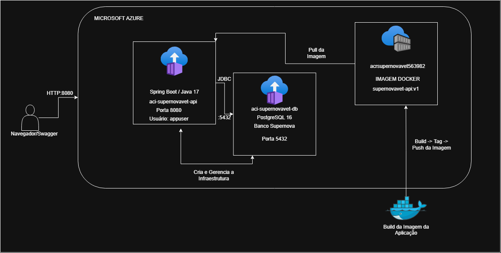

# SuperNova VET - DevOps & Cloud Computing

Projeto desenvolvido para a disciplina de **DevOps Tools & Cloud Computing**.

A solução utiliza uma arquitetura totalmente containerizada na Microsoft Azure, seguindo a opção **ACR + ACI**.

A aplicação foi desenvolvida em **Java com Spring Boot** e utiliza **PostgreSQL 16** como banco de dados.

---

## Integrantes

- Felipe Augusto Lopes Ferreira
- Kaique Mascarenhas dos Santos

---

# Sobre o projeto

O **SuperNova VET** é uma API para gerenciamento de tutores e pets de uma clínica veterinária.

A aplicação permite realizar operações de cadastro, consulta, atualização e exclusão de dados relacionados às duas principais entidades do sistema:

- Tutores
- Pets

Cada pet possui um tutor responsável, formando um relacionamento entre as duas tabelas principais da aplicação.

A solução utiliza uma arquitetura totalmente containerizada. Tanto a API quanto o banco PostgreSQL são executados através do **Azure Container Instances (ACI)**.

A imagem Docker da API é armazenada no **Azure Container Registry (ACR)**.

---

# Benefícios para o negócio

A solução permite centralizar as informações dos tutores e seus respectivos pets em um único sistema.

Entre os principais benefícios estão:

- Centralização dos dados dos clientes e animais.
- Facilidade na consulta das informações cadastradas.
- Atualização rápida dos dados dos pets e tutores.
- Associação entre cada pet e seu tutor responsável.
- Classificação do nível de risco dos animais.
- Redução de cadastros manuais e informações descentralizadas.
- Disponibilidade da aplicação através de infraestrutura em nuvem.
- Padronização do ambiente utilizando containers.
- Facilidade de implantação da aplicação.
- Separação entre aplicação e banco de dados.

---

# Arquitetura da solução

A solução utiliza os seguintes recursos e tecnologias:

- **Azure Container Registry (ACR)** para armazenar a imagem Docker da API.
- **Azure Container Instances (ACI)** para executar a API Spring Boot.
- **Azure Container Instances (ACI)** para executar o PostgreSQL 16.
- **Docker** para criação da imagem da aplicação.
- **Azure CLI** para criação e configuração dos recursos da Azure.
- **Spring Data JPA** para comunicação da aplicação com o banco.
- **Flyway** para versionamento e criação da estrutura do banco.

Todos os recursos Azure utilizados pela solução são criados através da Azure CLI.

## Diagrama da arquitetura



## Fluxo da solução

O usuário acessa a API através do Swagger.

A API Spring Boot é executada em um Azure Container Instance e recebe as requisições HTTP.

A aplicação utiliza Spring Data JPA para realizar as operações no PostgreSQL, que também é executado em um Azure Container Instance.

A imagem Docker utilizada pelo container da API é armazenada no Azure Container Registry.

O fluxo principal é:

```text
Usuário / Swagger
        |
        | HTTP - Porta 8080
        v
Azure Container Instances
     API Spring Boot
        |
        | JDBC - Porta 5432
        v
Azure Container Instances
      PostgreSQL 16
```

O fluxo da imagem Docker é:

```text
Código-fonte
     |
     v
Docker Build
     |
     v
Azure Container Registry
     |
     v
Azure Container Instances
       API
```

---

# Tecnologias utilizadas

- Java 17
- Spring Boot
- Spring Data JPA
- Spring Security
- Bean Validation
- Flyway
- PostgreSQL 16
- Maven
- Docker
- Azure CLI
- Azure Container Registry
- Azure Container Instances
- Swagger / OpenAPI
- Git
- GitHub

---

# Banco de dados

A aplicação utiliza **PostgreSQL 16**.

O PostgreSQL é executado dentro de um container no **Azure Container Instances**, seguindo a arquitetura ACR + ACI escolhida para o projeto.

As duas tabelas principais utilizadas para demonstrar o CRUD são:

- `ch_tutor`
- `ch_pet`

Essas tabelas possuem relacionamento através do campo `id_tutor`.

---

## Tabela ch_tutor

A tabela `ch_tutor` armazena os tutores responsáveis pelos pets.

Principais campos:

```text
id_tutor
nm_tutor
ds_email
nr_telefone
ds_senha
ds_perfil
```

O campo `id_tutor` é a chave primária da tabela.

---

## Tabela ch_pet

A tabela `ch_pet` armazena os pets cadastrados no sistema.

Principais campos:

```text
id_pet
nm_pet
nr_idade
ds_especie
ds_nivel_risco
id_tutor
```

O campo `id_pet` é a chave primária.

O campo `id_tutor` é uma chave estrangeira que relaciona o pet ao seu tutor.

O relacionamento utilizado é:

```text
Tutor 1 ---- N Pets
```

---

# Script DDL

O projeto possui um script separado contendo a estrutura das tabelas principais:

```text
script_bd.sql
```

O arquivo contém:

- Criação da tabela `ch_tutor`.
- Criação da tabela `ch_pet`.
- Chaves primárias.
- Chave estrangeira entre Pet e Tutor.
- Restrições de dados.
- Comentários das tabelas.
- Comentários das principais colunas.

O banco utilizado pelo projeto é PostgreSQL, portanto o script utiliza tipos compatíveis com PostgreSQL, como:

```sql
BIGSERIAL
BIGINT
INTEGER
VARCHAR
```

---

# Flyway

A aplicação utiliza **Flyway** para controlar as versões do banco de dados.

As migrations estão localizadas em:

```text
src/main/resources/db/migration
```

As migrations criam a estrutura necessária para a aplicação quando ela é executada em um banco PostgreSQL novo.

A aplicação utiliza:

```properties
spring.flyway.enabled=true
spring.flyway.baseline-on-migrate=true
spring.flyway.baseline-version=1
```

---

# Estrutura principal do projeto

```text
SUPERNOVAVET-DEVOPS
│
├── azure
│   ├── criacao.sh
│   └── deletar.sh
│
├── docs
│   └── arquitetura-supernovavet.png
│
├── src
│   └── main
│       ├── java
│       └── resources
│           └── db
│               └── migration
│
├── Dockerfile
├── script_bd.sql
├── pom.xml
├── mvnw
├── mvnw.cmd
└── README.md
```

---

# Pré-requisitos

Antes de executar o projeto, é necessário possuir:

- Git
- Docker Desktop
- Azure CLI
- Conta Microsoft Azure
- Acesso a uma assinatura Azure
- Git Bash para executar os scripts `.sh` no Windows

O Docker Desktop deve estar em execução antes da criação da infraestrutura.

---

# Clonando o projeto

Clone o repositório:

```bash
git clone https://github.com/FelipeAugusto99/SUPERNOVAVET-DEVOPS.git
```

Entre na pasta:

```bash
cd SUPERNOVAVET-DEVOPS
```

---

# Login na Azure

Realize o login utilizando a Azure CLI:

```bash
az login
```

Para visualizar as assinaturas disponíveis:

```bash
az account list --output table
```

Caso seja necessário selecionar uma assinatura:

```bash
az account set --subscription "<NOME-OU-ID-DA-SUBSCRIPTION>"
```

---

# Criação da infraestrutura

A infraestrutura completa pode ser criada através do script:

```text
azure/criacao.sh
```

No Git Bash, execute:

```bash
bash azure/criacao.sh
```

Durante a execução, o script solicita a senha que será utilizada pelo PostgreSQL.

A senha é digitada em tempo de execução e não fica armazenada diretamente no script.

O script realiza:

1. Criação do Resource Group.
2. Registro do provider `Microsoft.ContainerInstance`.
3. Espera pela conclusão do registro do provider.
4. Criação do Azure Container Registry.
5. Login no ACR.
6. Build da imagem Docker da API.
7. Criação da tag da imagem.
8. Push da imagem para o ACR.
9. Criação do PostgreSQL no Azure Container Instances.
10. Espera pela inicialização do container PostgreSQL.
11. Obtenção das credenciais necessárias do ACR.
12. Criação da API no Azure Container Instances.
13. Configuração das variáveis de conexão com o PostgreSQL.
14. Espera pela inicialização do container da API.
15. Exibição do estado final dos containers.
16. Exibição do endereço do Swagger.

---

# Recursos Azure criados

A solução utiliza os seguintes recursos:

```text
Resource Group:
rg-supernovavet-devops

Azure Container Registry:
acrsupernovavet563982

Azure Container Instance - API:
aci-supernovavet-api

Azure Container Instance - PostgreSQL:
aci-supernovavet-db
```

Região utilizada:

```text
Brazil South
```

---

# Docker

A aplicação possui um `Dockerfile` responsável pela criação da imagem da API.

O Dockerfile utiliza duas etapas.

Na primeira etapa é realizado o build da aplicação.

Na segunda etapa é criada a imagem utilizada para executar a API.

Build manual:

```bash
docker build -t supernovavet-api .
```

---

# Container sem usuário root

O container da aplicação não é executado utilizando o usuário `root`.

O Dockerfile cria um usuário específico:

```dockerfile
RUN useradd -m appuser
```

A propriedade do arquivo da aplicação é atribuída ao usuário:

```dockerfile
RUN chown appuser:appuser app.jar
```

E a execução passa a utilizar:

```dockerfile
USER appuser
```

Dessa forma, o processo Java é executado com permissões reduzidas dentro do container.

---

# Azure Container Registry

O Azure Container Registry armazena a imagem Docker utilizada pela API.

Login manual no ACR:

```bash
az acr login --name acrsupernovavet563982
```

Criação da tag:

```bash
docker tag supernovavet-api:latest \
acrsupernovavet563982.azurecr.io/supernovavet-api:v1
```

Envio da imagem:

```bash
docker push \
acrsupernovavet563982.azurecr.io/supernovavet-api:v1
```

Para consultar as imagens armazenadas:

```bash
az acr repository list \
  --name acrsupernovavet563982 \
  --output table
```

---

# Configuração do PostgreSQL

O PostgreSQL utiliza as seguintes configurações:

```text
Banco:
supernova

Usuário:
postgres

Porta:
5432
```

A senha não é armazenada diretamente no repositório.

Ela é solicitada pelo script durante a criação da infraestrutura.

---

# Variáveis de ambiente da API

A aplicação recebe as configurações do banco através das seguintes variáveis:

```text
DB_HOST
DB_PORT
DB_NAME
DB_USERNAME
DB_PASSWORD
```

O `application.properties` utiliza essas variáveis:

```properties
spring.datasource.url=jdbc:postgresql://${DB_HOST:localhost}:${DB_PORT:5432}/${DB_NAME:supernova}
spring.datasource.username=${DB_USERNAME:postgres}
spring.datasource.password=${DB_PASSWORD}
spring.datasource.driver-class-name=org.postgresql.Driver

spring.jpa.hibernate.ddl-auto=validate
spring.jpa.show-sql=true
spring.jpa.properties.hibernate.format_sql=true
spring.jpa.database-platform=org.hibernate.dialect.PostgreSQLDialect

spring.flyway.enabled=true
spring.flyway.baseline-on-migrate=true
spring.flyway.baseline-version=1
```

Dessa forma, nenhuma senha de infraestrutura precisa ficar armazenada diretamente no código-fonte.

---

# Acessando o Swagger

Após a criação da infraestrutura, a API fica disponível através do Azure Container Instance.

Swagger:

```text
http://supernovavet-api-563982.brazilsouth.azurecontainer.io:8080/swagger-ui/index.html
```

---

# CRUD de Tutores

A aplicação possui operações de inclusão, consulta, atualização e exclusão para a entidade Tutor.

---

## Consultar tutores

```http
GET /tutores
```

---

## Criar tutor

```http
POST /tutores
```

Exemplo:

```json
{
  "nome": "Tutor Teste",
  "email": "tutor.teste@supernovavet.com",
  "telefone": "11977776666",
  "senha": "senhaExemplo123",
  "perfil": "TUTOR"
}
```

Após a inclusão, o registro pode ser comprovado diretamente no PostgreSQL através de:

```sql
SELECT
    id_tutor,
    nm_tutor,
    ds_email,
    nr_telefone,
    ds_perfil
FROM ch_tutor
ORDER BY id_tutor;
```

---

## Atualizar tutor

```http
PUT /tutores/{id}
```

Exemplo:

```json
{
  "nome": "Tutor Atualizado",
  "email": "tutor.atualizado@supernovavet.com",
  "telefone": "11966665555"
}
```

A implementação atualiza os campos:

```text
nome
email
telefone
```

Após a atualização, o resultado pode ser conferido diretamente no banco:

```sql
SELECT
    id_tutor,
    nm_tutor,
    ds_email,
    nr_telefone,
    ds_perfil
FROM ch_tutor
ORDER BY id_tutor;
```

---

## Excluir tutor

```http
DELETE /tutores/{id}
```

A aplicação impede a exclusão de um tutor caso existam pets relacionados a ele.

Depois da exclusão de um tutor sem pets relacionados, a operação pode ser comprovada através de:

```sql
SELECT *
FROM ch_tutor
WHERE id_tutor = <ID_DO_TUTOR>;
```

O resultado esperado após a exclusão é nenhum registro para aquele ID.

---

# CRUD de Pets

A aplicação também possui CRUD completo para a entidade Pet.

---

## Consultar pets

```http
GET /pets
```

---

## Criar primeiro pet

```http
POST /pets
```

Exemplo:

```json
{
  "nome": "Luna",
  "idade": 6,
  "especie": "CACHORRO",
  "nivelRisco": "BAIXO",
  "tutor": {
    "id": 1,
    "nome": "Administrador",
    "email": "admin@supernovavet.com",
    "telefone": "11999999999"
  }
}
```

---

## Criar segundo pet

```http
POST /pets
```

Exemplo:

```json
{
  "nome": "Thor",
  "idade": 4,
  "especie": "CACHORRO",
  "nivelRisco": "MEDIO",
  "tutor": {
    "id": 2,
    "nome": "Veterinario",
    "email": "vet@supernovavet.com",
    "telefone": "11888888888"
  }
}
```

Depois das inclusões, os registros podem ser comprovados diretamente no PostgreSQL:

```sql
SELECT
    id_pet,
    nm_pet,
    nr_idade,
    ds_especie,
    ds_nivel_risco,
    id_tutor
FROM ch_pet
ORDER BY id_pet;
```

---

## Atualizar pet

```http
PUT /pets/{id}
```

Exemplo:

```json
{
  "nome": "Luna Atualizada",
  "idade": 7,
  "especie": "CACHORRO",
  "nivelRisco": "ALTO"
}
```

A implementação atualiza:

```text
nome
idade
especie
nivelRisco
```

Depois da atualização:

```sql
SELECT
    id_pet,
    nm_pet,
    nr_idade,
    ds_especie,
    ds_nivel_risco,
    id_tutor
FROM ch_pet
WHERE id_pet = <ID_DO_PET>;
```

---

## Excluir pet

```http
DELETE /pets/{id}
```

Depois da exclusão:

```sql
SELECT *
FROM ch_pet
WHERE id_pet = <ID_DO_PET>;
```

O resultado esperado é nenhum registro para o ID excluído.

---

# Verificação direta no PostgreSQL

Para comprovar que os dados enviados através da API foram realmente persistidos no PostgreSQL executado na Azure, é possível acessar diretamente o container do banco.

Execute:

```bash
az container exec \
  --resource-group rg-supernovavet-devops \
  --name aci-supernovavet-db \
  --exec-command "psql -U postgres -d supernova"
```

O terminal do PostgreSQL será exibido:

```text
supernova=#
```

---

# Consultar tutores diretamente no banco

```sql
SELECT
    id_tutor,
    nm_tutor,
    ds_email,
    nr_telefone,
    ds_perfil
FROM ch_tutor
ORDER BY id_tutor;
```

---

# Consultar pets diretamente no banco

```sql
SELECT
    id_pet,
    nm_pet,
    nr_idade,
    ds_especie,
    ds_nivel_risco,
    id_tutor
FROM ch_pet
ORDER BY id_pet;
```

---

# Consultar relacionamento entre Pet e Tutor

```sql
SELECT
    p.id_pet,
    p.nm_pet AS pet,
    p.ds_nivel_risco,
    t.id_tutor,
    t.nm_tutor AS tutor
FROM ch_pet p
INNER JOIN ch_tutor t
    ON p.id_tutor = t.id_tutor
ORDER BY p.id_pet;
```

Para sair do PostgreSQL:

```text
\q
```

---

# Comprovação do CRUD

Durante a demonstração da solução, cada operação realizada através da API pode ser comprovada diretamente no PostgreSQL.

O fluxo utilizado para cada entidade é:

```text
POST
  |
  v
SELECT no PostgreSQL
  |
  v
GET
  |
  v
SELECT no PostgreSQL
  |
  v
PUT
  |
  v
SELECT no PostgreSQL
  |
  v
DELETE
  |
  v
SELECT no PostgreSQL
```

Esse processo demonstra que as operações realizadas pela API estão sendo persistidas no banco PostgreSQL executado na nuvem.

---

# Verificando logs da API

Os logs da aplicação podem ser consultados através da Azure CLI:

```bash
az container logs \
  --resource-group rg-supernovavet-devops \
  --name aci-supernovavet-api
```

Nos logs é possível verificar:

- Inicialização do Spring Boot.
- Execução da aplicação utilizando `appuser`.
- Conexão com PostgreSQL.
- Validação e execução das migrations Flyway.
- Inicialização do Tomcat na porta 8080.

---

# Verificando o container da API

```bash
az container show \
  --resource-group rg-supernovavet-devops \
  --name aci-supernovavet-api \
  --query "{estado:instanceView.state,ip:ipAddress.ip,fqdn:ipAddress.fqdn}" \
  --output table
```

O estado esperado é:

```text
Running
```

---

# Verificando o container PostgreSQL

```bash
az container show \
  --resource-group rg-supernovavet-devops \
  --name aci-supernovavet-db \
  --query "{estado:instanceView.state,ip:ipAddress.ip,fqdn:ipAddress.fqdn}" \
  --output table
```

O estado esperado é:

```text
Running
```

---

# Segurança

A solução utiliza algumas práticas para evitar exposição desnecessária de credenciais e permissões.

A aplicação:

- Não é executada como usuário root dentro do container.
- Utiliza um usuário específico chamado `appuser`.
- Recebe a senha do PostgreSQL através de variável de ambiente.
- Não possui a senha da infraestrutura Azure armazenada no `application.properties`.
- Utiliza `--secure-environment-variables` para enviar a senha do PostgreSQL ao ACI.
- Obtém as credenciais do ACR durante a execução do script.
- Armazena a imagem da API no Azure Container Registry.

---

# Exclusão da infraestrutura

Para evitar consumo desnecessário dos créditos da Azure, a infraestrutura pode ser removida através do script:

```text
azure/deletar.sh
```

Execute:

```bash
bash azure/deletar.sh
```

O script solicita a exclusão do Resource Group:

```text
rg-supernovavet-devops
```

Como os recursos da solução estão dentro desse Resource Group, a exclusão também remove:

- Azure Container Registry.
- Azure Container Instance da API.
- Azure Container Instance do PostgreSQL.

Para verificar se o Resource Group ainda existe:

```bash
az group exists --name rg-supernovavet-devops
```

Quando a exclusão estiver concluída, o resultado será:

```text
false
```

---

# Persistência e integração

A comunicação entre a aplicação e o banco segue o seguinte fluxo:

```text
Swagger / Cliente
        |
        v
API Spring Boot
Azure Container Instances
        |
        v
Spring Data JPA
        |
        v
PostgreSQL 16
Azure Container Instances
```

As operações realizadas através da API podem ser verificadas diretamente no PostgreSQL utilizando comandos `SELECT`.

Dessa forma, é possível comprovar a comunicação entre a aplicação e o banco de dados executados na Azure.

---

# Limpeza dos recursos

Os recursos utilizados neste projeto são destinados ao ambiente acadêmico.

Após os testes ou demonstrações, recomenda-se executar:

```bash
bash azure/deletar.sh
```

para evitar consumo desnecessário dos créditos da assinatura Azure.
